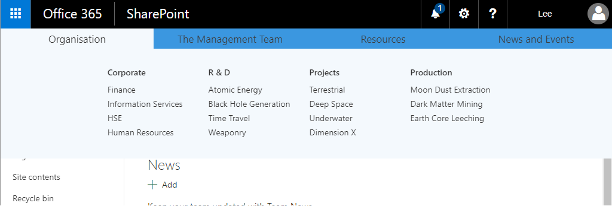
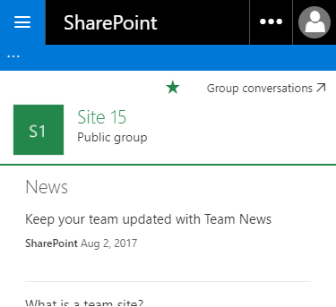
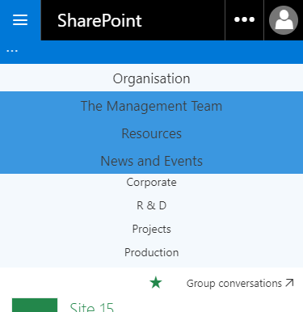
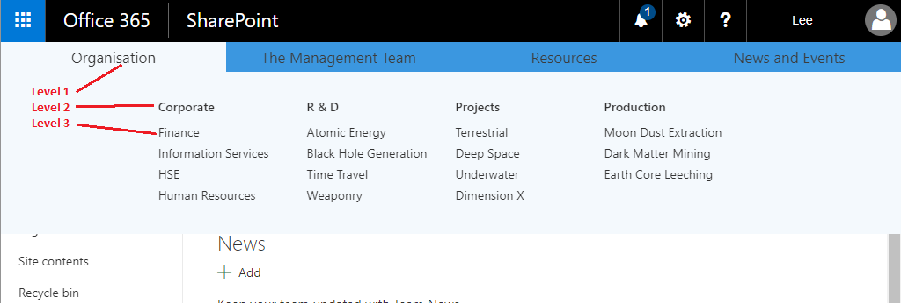

# modern-sp-mega-menu

## Introduction
_NOTE_ - This repo isn't being actively maintained! It's probably not current anymore and there are probably better ways to do things now. I put it together a couple of years ago while learning some concepts, but don't have the time to maintain it or look at issues myself. Hope you get some value nonetheless!

This is a mega menu for the modern SharePoint Online experience. It uses the preview version of SharePoint Framework Extensions. See [here](https://dev.office.com/sharepoint/docs/spfx/extensions/overview-extensions) for all info about getting SPFX extensions up and running e.g. toolchain, deploying to CDN etc.

The purpose of the project was to get some practice with several technologies -
- SPFX
- React
- Office UI Fabric
- Responsive Design
- Typescript
- SASS
- PnP JS & PnP Powershell

Office UI Fabric and indeed the modern SPO experiences are built on React, so it was a sound decision to use in this project and a useful technology to learn.

The menu is responsive, and renders differently on desktop or smaller screens.

Desktop view :



Mobile view (contracted) :



Mobile view (expanded) (*I'm not a UX person or a designer - the mobile view of the menu gives the idea, but isn't the work of Leonardo da Vinci*) :



The menu consists of 3 levels of navigation. On the desktop view, hovering over the L1 item shows the L2 and L3 items under it. In the mobile view, the L2 items are touched to view the items under them.



The project generates an SPFX app / add-in, which is uploaded to the app catalog in the normal way, and added to sites to take effect. Note, due to current SPFX limitations, you must install the app to any sites you want it to take effect on. Hopefully in future it will be possible to deploy once to an entire site collection.

## Configuring SPO for Mega Menu
The mega menu is driven by 3 lists in the root of the site collection. These define level 1, 2 and 3 items respectively. Level 2 items look up to level 1 items, and level 3 items look up to level 2 items. The names of these lists are hard-coded and cannot be re-configured without rebuilding the code. They are "Mega Menu - Level 1", "Mega Menu - Level 2" and "Mega Menu - Level 3".

The script *provisioning\create-lists.ps1* creates the 3 required lists at the root site of the site collection, and populates with initial sample data. Note this requires PnP Powershell module to be installed. See [here](https://github.com/SharePoint/PnP-PowerShell).

Usage :

```powershell
.\create-lists.ps1 -siteCollectionUrl <site collection root URL>
```

Now add app *Mega Menu for Modern SP* to sites as desired.

## Packaging and running locally

1. `gulp bundle`
2. `gulp package-solution`
3. `gulp serve --nobrowser`
4. Upload to app catalog

## Packaging and running from CDN

1. `gulp bundle --ship`
2. `gulp package-solution --ship`
3. Re-upload solution to app store.
4. Manually upload the files from *temp/deploy* to the CDN folder as described in SPFX docco.

## Some limitations
- At this pre-release point, SPFX extensions seem to be intermittent in their ability to find particular page placeholders. If it is consistently failing to find the header placeholder (see console), try hard refreshing the page in the browser, or opening the same page in a new tab.
- The components use the Fabric UI theme classes e.g. `ms-bgColor-themePrimary`. These seem to behave differently depending on which page you're on - for actual modern content pages, they use the configured theme, but for system pages e.g. View All Site Content they use a grey theme.
- Due to current SPFX limitations, you must install the app to any sites you want it to take effect on. Hopefully in future it will be possible to deploy once to an entire site collection.
- This solution only applies to **modern** pages in SPO. To apply to classic pages too, you would need a parallel solution to inject the
same code the old-fashioned way e.g. custom action.

## How it works
The entry point of the extension is class `ModernSpMegaMenuApplicationCustomizer`. The `onRender()` method looks for the "PageHeader" placeholder and inserts a `MegaMenu` React component into it. That component is then composed of other components to render out the various menu items and the menu flyout.

The `MegaMenu` component has a property called `topLevelMenuItems` which defines the top-level menu items to display. 2 levels of nested references inside those contain the level 2 and level 3 menu items.

The items to display are read from the configuration lists via class `MegaMenuService`. This uses the Typescript typings for the PnP JS libraries which make it much easier to interface with SP and provide a layer over the top of the REST API. PnP JS is also used to cache the result in the browser's session cache.

The user interface inside the React components is provided by Office UI Fabric, which is the Office design language, and is intended to help make your apps look like native Office 365. It provides a lot of Bootstrap-like classes and utilities, and provides some nice ways for React components to detect responsive state, e.g. adding `@withResponsiveMode` to the React component class. 
